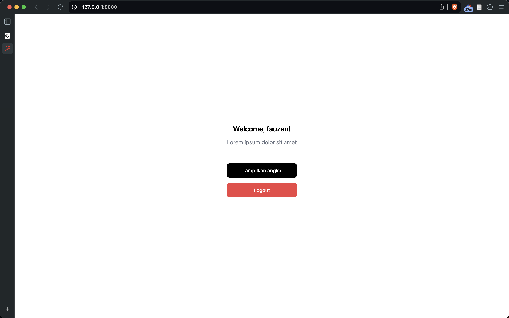
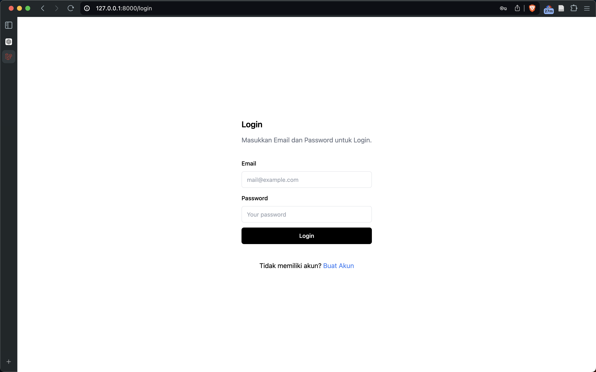
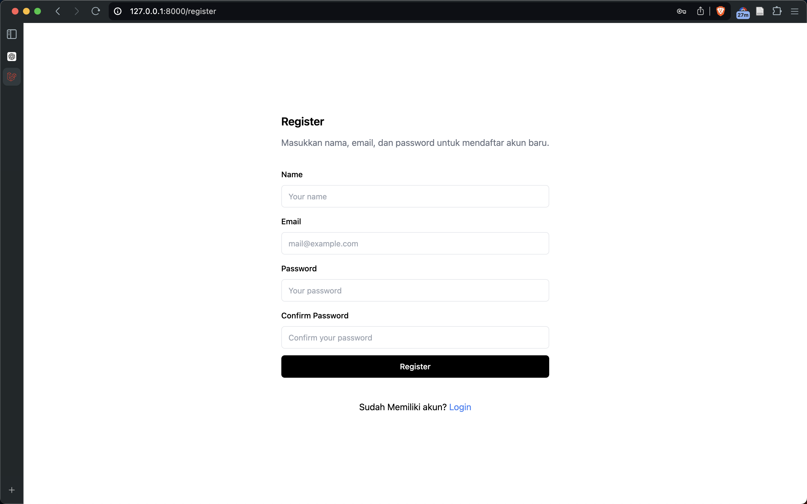
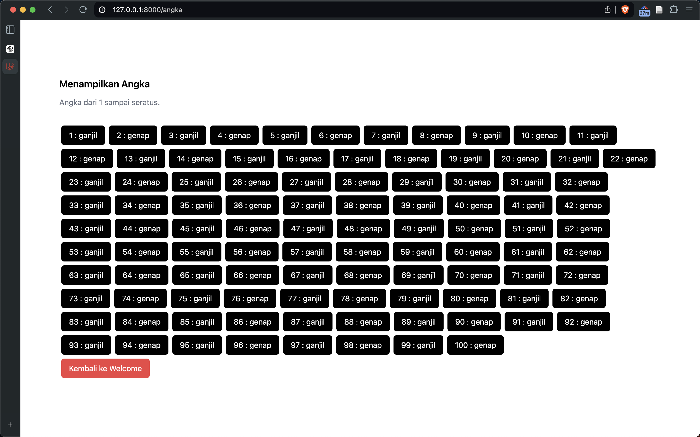
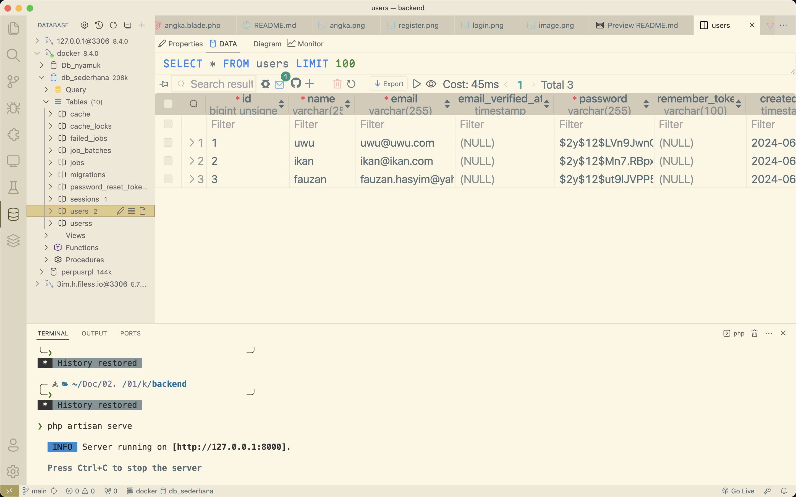

# Backend

Ini adalah website login dan juga perhitungan angka 1-100.

## Teknologi yang Digunakan

- **TailwindCSS**
- **Laravel 11**

## Cara Install

1. Install dependencies dengan Composer:
    ```bash
    composer install
    ```

2. Salin file `env.example` dan ubah namanya menjadi `.env`:
    ```bash
    cp .env.example .env
    ```

3. Generate key aplikasi:
    ```bash
    php artisan key:generate
    ```

4. Migrasi database:
    ```bash
    php artisan migrate
    ```

5. Jalankan server:
    ```bash
    php artisan serve
    ```

Sekarang Anda dapat mengakses aplikasi di browser melalui alamat [http://localhost:8000](http://localhost:8000).

## Screenshots

### Tampilan Home/Menu Utama


### Halaman Login


### Halaman Registrasi


### Halaman Perhitungan Angka


### Struktur Database

